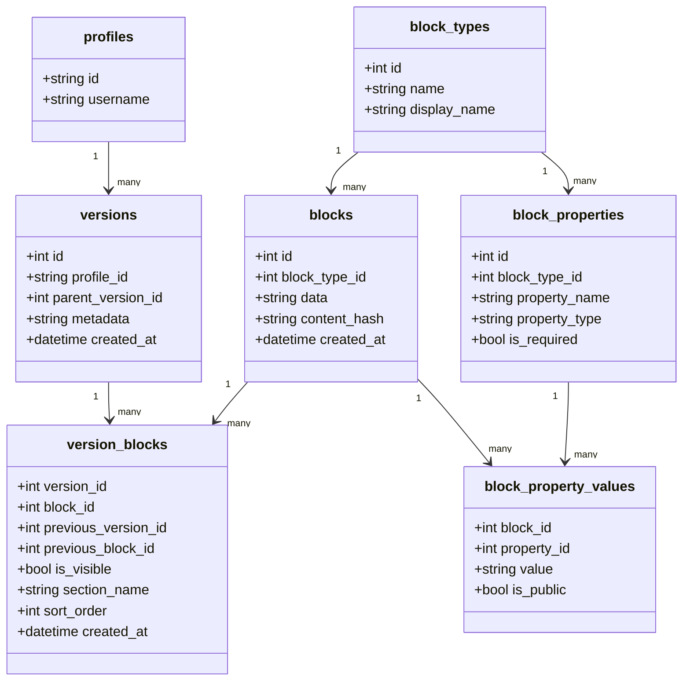
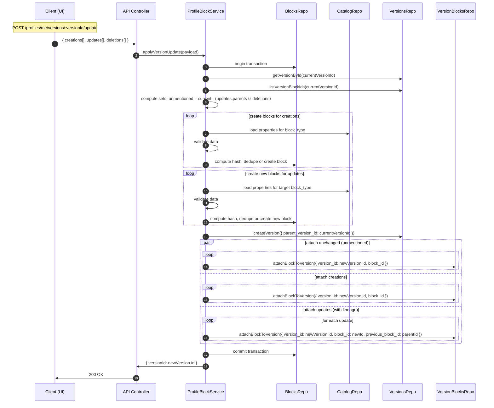

# MONOLENZ

**Write once. Publish everywhere.** One source of truth for your professional identity.

Monolenz is an open-source profile builder: create a structured professional profile, share it at `/{username}`, hide entries you are not ready to show, and print a resume from the browser.

## What works today

- Email signup, login, and password reset (JWT sessions stored in Neon)
- Username onboarding and profile info (bio, links, picture URL, themes)
- Content editor for 8 types: work, education, skills, projects, certifications, languages, volunteer, awards
- Immutable versioned saves (edits create a new snapshot; blocks are deduplicated by content hash)
- Public page at `/{username}` with copy-link and Print / Save as PDF
- Per-entry public/hidden visibility

## Roadmap (not shipped)

ATS-tailored resume generation, application tracking, OAuth, billing, and a full version-history UI.

## Tech Stack

- **Frontend**: Next.js 15, React 19, TypeScript
- **Backend**: Express.js, TypeScript
- **Database**: Neon PostgreSQL with Prisma ORM
- **Authentication**: Email/password + JWT (own `users` table)
- **Storage**: AWS S3
- **Styling**: Tailwind CSS v4, shadcn/ui
- **Package Manager**: pnpm
- **Monorepo**: Turborepo

## Project Structure

```text
monolenz/
├── apps/
│   ├── web/                    # Next.js frontend application
│   │   ├── app/               # App router pages and layouts
│   │   ├── public/            # Static assets
│   │   └── package.json
│   └── api/                   # Express.js backend API
│       ├── src/
│       │   ├── config/        # Configuration
│       │   ├── controllers/   # HTTP request/response handling
│       │   ├── database/      # Database Schema
│       │   ├── middleware/    # Express middleware
│       │   ├── repositories/  # Data access layer
│       │   ├── routes/        # HTTP route definitions
│       │   ├── services/      # Business logic layer
│       │   │   ├── domain/    # Internal business logic
│       │   │   ├── external/  # Third-party integrations
│       │   │   ├── infrastructure/ # Technical services
│       │   │   └── shared/    # Cross-cutting concerns
│       │   └── types/         # TypeScript type definitions
│       │   ├── utils/         # Helper utilities
│       ├── prisma/
│       │   ├── migrations/    # Database migrations
│       │   └── seed/          # Database seeding
│       ├── tests/             # Test files
│       │   ├── unit/
│       │   ├── integration/
│       │   └── helpers/
│       └── package.json
├── packages/
│   ├── eslint-config/         # Shared ESLint configurations
│   ├── typescript-config/     # Shared TypeScript configurations
│   ├── types/                 # Shared TypeScript types and interfaces
│   ├── shared/                # Shared utilities and configurations
│   └── config/                # Shared configuration files
├── tools/                     # Build tools and scripts
├── docs/                      # Documentation
├── turbo.json                 # Turborepo configuration
├── pnpm-workspace.yaml        # pnpm workspace configuration
└── package.json               # Root package.json
```

## Prerequisites

- **Node.js**: >=18.0.0
- **pnpm**: >=9.0.0
- **PostgreSQL**: >=14.0
- **Git**

## Local setup

```bash
pnpm install
cp apps/api/.env.example apps/api/.env
cp apps/web/.env.example apps/web/.env.local
```

Fill in a Neon `DATABASE_URL`, a shared `AUTH_SECRET` (32+ characters) in both `apps/api/.env` and `apps/web/.env.local`, and `NEXT_PUBLIC_API_URL` (default `http://localhost:4000`). Optional: `RESEND_API_KEY` for password-reset emails.

```bash
pnpm --filter api db:generate
pnpm --filter api db:push
pnpm --filter @monolenz/types build
pnpm dev
```

- Web: [http://localhost:3000](http://localhost:3000)
- Public demo: [https://monolenz.sherlemious.com](https://monolenz.sherlemious.com)
- API: [http://localhost:4000](http://localhost:4000)

Commands from the repo root:

```bash
pnpm lint
pnpm check-types
pnpm format
pnpm build
```

## Architecture

### Block-Based Versioning

Monolenz uses a **block-based versioning system** inspired by Git, where professional information is stored as immutable content blocks. This enables:

- **Complete version history** of profile changes
- **Structural sharing** for storage efficiency
- **Point-in-time reconstruction** of any profile version
- **Content deduplication** across users

### Data Flow

1. **Profile Data** → Immutable blocks in PostgreSQL
2. **Versions** → Snapshots referencing specific blocks
3. **Resumes/Portfolios** → Compositions of versioned blocks
4. **Export** → HTML generation → PDF conversion (resumes) or static site (portfolios)

### Authentication

```text
┌─────────────────────────────────────────────────────────────────────────────┐
│                               ARCHITECTURE                                  │
└─────────────────────────────────────────────────────────────────────────────┘

┌─────────────────┐                    ┌─────────────────┐
│   Next.js App   │                    │  Express API    │
│                 │   Bearer JWT       │                 │
│ • Login/Signup  │───────────────────►│ • Verify JWT    │
│ • Session cookie│                    │ • Profile CRUD  │
│ • Route Guards  │                    │ • Validation    │
└─────────────────┘                    └────────┬────────┘
                                                │
                                                ▼
                                       ┌─────────────────┐
                                       │  Neon Postgres  │
                                       │ • users         │
                                       │ • profiles      │
                                       │ • versions      │
                                       │ • blocks        │
                                       └─────────────────┘
```

## Versioning and Blocks (Profile Pages)

This system models profile content as immutable blocks and versioned snapshots.

- Blocks are immutable content blobs, deduplicated by `content_hash`.
- A `version` is a snapshot of a profile at a point in time.
- The `version_blocks` junction ties blocks to a version and stores lineage plus presentation details.
- Block schemas are managed centrally via `block_types` and `block_properties`.

### Data model overview



Key points:

- Blocks are immutable. To change content, create a new block and attach it to a new or target version.
- Lineage is version-scoped: `version_blocks.previous_block_id` links a block to the one it supersedes in that chain.
- Visibility is immutable per version: changing visibility creates a new version with the desired `is_visible` state.
- Property-level privacy is enforced via `block_property_values.is_public` on reads for public users.

### Version update (batch) sequence



Note: Deletions are part of the batch version update (they are omitted from the new version). There is no separate delete flow endpoint.

## Contributing

Please read [CONTRIBUTING.md](./CONTRIBUTING.md) for branch naming, commit conventions, PR workflow, and review expectations.

### Branching and Releases

Monolenz uses a staging-first flow:

- `main` - Production branch
- `stage` - Integration and staging branch
- `feature/*` branches - Short-lived branches merged into `stage` via PR

Release flow:

1. Merge feature branches into `stage`
2. Validate changes in staging
3. Promote `stage` to `main` via PR for production release

CI triggers:

- Quality checks run on `stage` and `main`
- Staging deploy runs on pushes to `stage`
- Production deploy runs on pushes to `main`

## License

MIT. See [LICENSE](./LICENSE).
