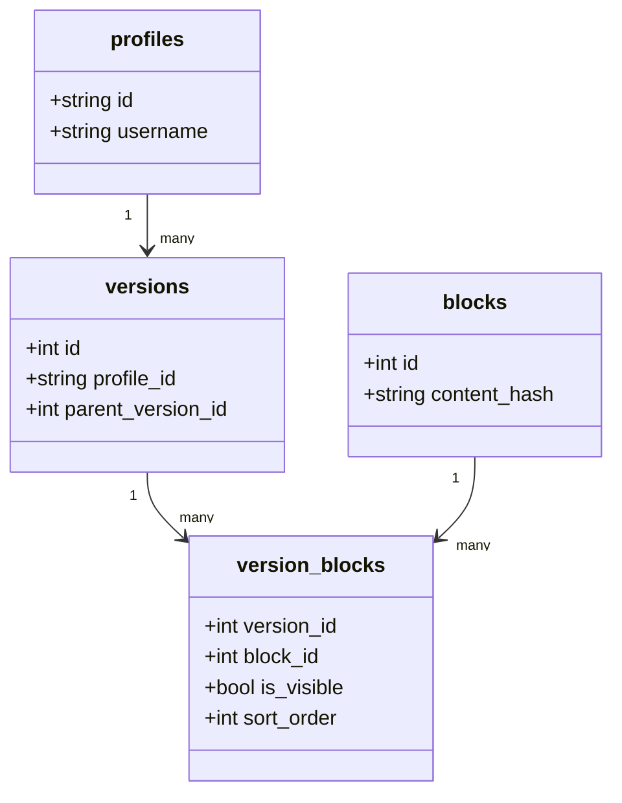

# MONOLENZ

**Write once. Publish everywhere.** One source of truth for your professional identity.

Monolenz is an open-source profile builder: create a structured professional profile, share it at `/{username}`, hide entries you are not ready to show, and print a resume from the browser.

## What works today

- Email signup, login, email verification, and password reset (Supabase Auth)
- Username onboarding and profile info (bio, links, picture URL, themes)
- Content editor for 8 types: work, education, skills, projects, certifications, languages, volunteer, awards
- Immutable versioned saves (edits create a new snapshot; blocks are deduplicated by content hash)
- Public page at `/{username}` with copy-link and Print / Save as PDF
- Per-entry public/hidden visibility

## Roadmap (not shipped)

ATS-tailored resume generation, application tracking, OAuth, billing, and a full version-history UI.

## Tech stack

- **Web**: Next.js 15, React 19, TypeScript, Tailwind CSS v4, shadcn/ui
- **API**: Express.js, Prisma, PostgreSQL
- **Auth**: Supabase
- **Monorepo**: Turborepo + pnpm

## Monorepo layout

```text
apps/web          Next.js app
apps/api          Express API
packages/types    Shared entities and Zod schemas
```

## Local setup

**Prerequisites:** Node.js >= 18, pnpm >= 9, PostgreSQL >= 14, a Supabase project.

```bash
pnpm install
cp apps/api/.env.example apps/api/.env
cp apps/web/.env.example apps/web/.env.local
```

Fill in Supabase URL/keys, `DATABASE_URL`, and `NEXT_PUBLIC_API_URL` (default `http://localhost:4000`).

```bash
pnpm --filter api db:generate
pnpm --filter api db:push
pnpm --filter @monolenz/types build
pnpm dev
```

- Web: [http://localhost:3000](http://localhost:3000)
- Public demo: [https://monolenz.sherlemious.com](https://monolenz.sherlemious.com)
- API: [http://localhost:4000](http://localhost:4000)

Commands from the repo root:

```bash
pnpm lint
pnpm check-types
pnpm format
pnpm build
```

## Architecture

Auth lives in the Next.js app (Supabase). The Express API verifies JWTs and owns profile/block business logic.

### Block-based versioning

Profile content is stored as immutable blocks, deduplicated by `content_hash`. A **version** is a snapshot. Saving the editor always creates a new version via `POST /api/v1/profiles/me/versions`.



## Contributing

See [CONTRIBUTING.md](./CONTRIBUTING.md).

Branch flow: feature branches → `stage` → `main`.

## License

MIT. See [LICENSE](./LICENSE).
