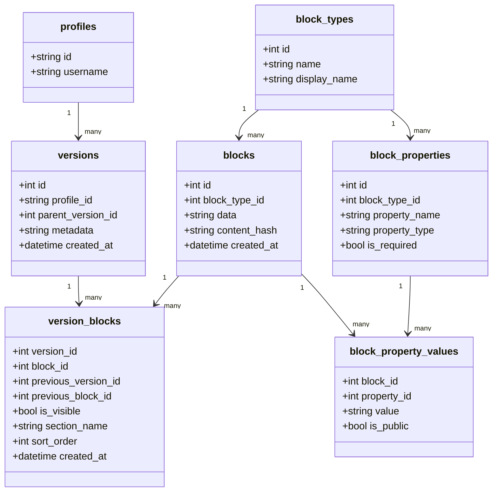
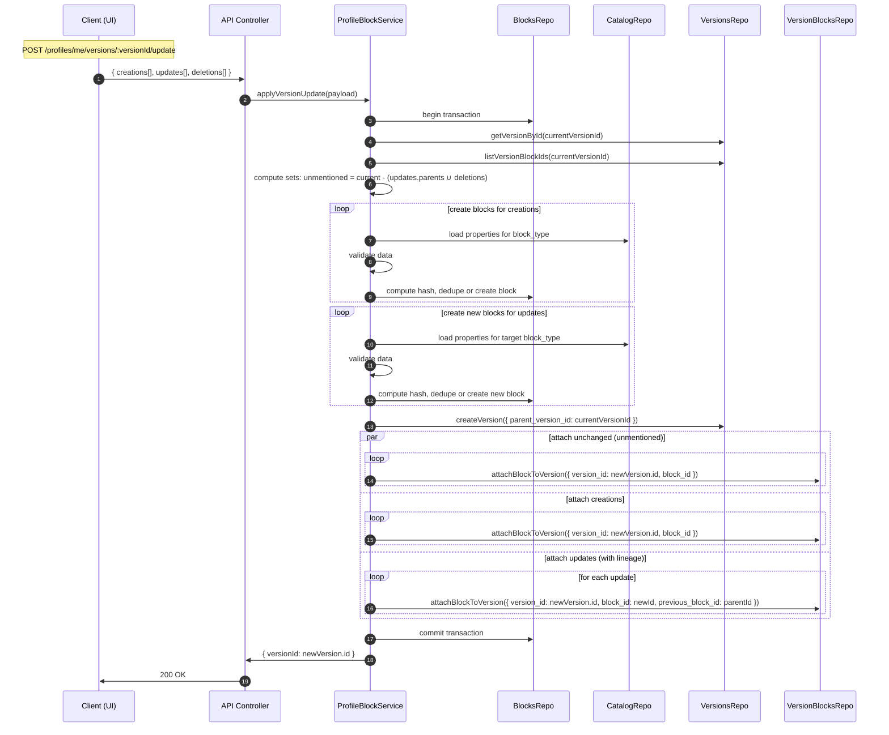

# MONOLENZ

**Write once, tailor everywhere. Your one-stop source-of-truth for your professional identity.**

Monolenz is a streamlined resume and portfolio builder platform designed for students and recent graduates. Create comprehensive professional profiles, generate tailored resumes, build stunning portfolios, and track job applications—all from a single platform.

## Tech Stack

- **Frontend**: Next.js 15, React 19, TypeScript
- **Backend**: Express.js, TypeScript
- **Database**: PostgreSQL with Prisma ORM
- **Authentication**: Supabase Auth
- **Storage**: AWS S3
- **Styling**: Tailwind CSS v4, shadcn/ui
- **Package Manager**: pnpm
- **Monorepo**: Turborepo

## Project Structure

```text
monolenz/
├── apps/
│   ├── web/                    # Next.js frontend application
│   │   ├── app/               # App router pages and layouts
│   │   ├── public/            # Static assets
│   │   └── package.json
│   └── api/                   # Express.js backend API
│       ├── src/
│       │   ├── config/        # Configuration
│       │   ├── controllers/   # HTTP request/response handling
│       │   ├── database/      # Database Schema
│       │   ├── middleware/    # Express middleware
│       │   ├── repositories/  # Data access layer
│       │   ├── routes/        # HTTP route definitions
│       │   ├── services/      # Business logic layer
│       │   │   ├── domain/    # Internal business logic
│       │   │   ├── external/  # Third-party integrations
│       │   │   ├── infrastructure/ # Technical services
│       │   │   └── shared/    # Cross-cutting concerns
│       │   └── types/         # TypeScript type definitions
│       │   ├── utils/         # Helper utilities
│       ├── prisma/
│       │   ├── migrations/    # Database migrations
│       │   └── seed/          # Database seeding
│       ├── tests/             # Test files
│       │   ├── unit/
│       │   ├── integration/
│       │   └── helpers/
│       └── package.json
├── packages/
│   ├── eslint-config/         # Shared ESLint configurations
│   ├── typescript-config/     # Shared TypeScript configurations
│   ├── types/                 # Shared TypeScript types and interfaces
│   ├── shared/                # Shared utilities and configurations
│   └── config/                # Shared configuration files
├── tools/                     # Build tools and scripts
├── docs/                      # Documentation
├── turbo.json                 # Turborepo configuration
├── pnpm-workspace.yaml        # pnpm workspace configuration
└── package.json               # Root package.json
```

## Prerequisites

- **Node.js**: >=18.0.0
- **pnpm**: >=9.0.0
- **PostgreSQL**: >=14.0
- **Git**

## Architecture

### Block-Based Versioning

Monolenz uses a **block-based versioning system** inspired by Git, where professional information is stored as immutable content blocks. This enables:

- **Complete version history** of profile changes
- **Structural sharing** for storage efficiency
- **Point-in-time reconstruction** of any profile version
- **Content deduplication** across users

### Data Flow

1. **Profile Data** → Immutable blocks in PostgreSQL
2. **Versions** → Snapshots referencing specific blocks
3. **Resumes/Portfolios** → Compositions of versioned blocks
4. **Export** → HTML generation → PDF conversion (resumes) or static site (portfolios)

### Authentication

```text
┌─────────────────────────────────────────────────────────────────────────────┐
│                               ARCHITECTURE                                  │
└─────────────────────────────────────────────────────────────────────────────┘

┌─────────────────┐                    ┌─────────────────┐
│   Next.js App   │◄──────────────────►│   Supabase      │
│                 │                    │                 │
│   AUTH OWNER    │                    │     SINGLE      │
│                 │                    │     SOURCE      │
│ • Login/Logout  │                    │                 │
│ • Registration  │                    │ • Auth Service  │
│ • Token Mgmt    │                    │ • JWT Tokens    │
│ • Route Guards  │                    │ • PostgreSQL    │
│ • User State    │                    │ • RLS Policies  │
│ • Direct DB     │◄──────────────────►│ • Realtime      │
│   Access (opt)  │                    │ • Storage       │
└─────────────────┘                    │ • Edge Funcs    │
         │                             └─────────────────┘
         │ API Calls                            ▲
         │ Bearer Token                         │
         ▼                                      │ DB Access
┌─────────────────┐                             │  + Auth
│  Express API    │◄────────────────────────────┘
│                 │
│    BUSINESS     │  • Connect to Supabase DB
│     LOGIC       │  • Use service role key
│                 │  • Leverage RLS policies
│ • Token Verify  │  • Business logic only
│ • Data CRUD     │  • No auth endpoints
│ • Validation    │  • Focus on API layer
│ • Rate Limits   │
│ • Aggregation   │
└─────────────────┘
```

## Versioning and Blocks (Profile Pages)

This system models profile content as immutable blocks and versioned snapshots.

- Blocks are immutable content blobs, deduplicated by `content_hash`.
- A `version` is a snapshot of a profile at a point in time.
- The `version_blocks` junction ties blocks to a version and stores lineage plus presentation details.
- Block schemas are managed centrally via `block_types` and `block_properties`.

### Data model overview



Key points:

- Blocks are immutable. To change content, create a new block and attach it to a new or target version.
- Lineage is version-scoped: `version_blocks.previous_block_id` links a block to the one it supersedes in that chain.
- Visibility is immutable per version: changing visibility creates a new version with the desired `is_visible` state.
- Property-level privacy is enforced via `block_property_values.is_public` on reads for public users.

### Version update (batch) sequence



Note: Deletions are part of the batch version update (they are omitted from the new version). There is no separate delete flow endpoint.

## Contributing

Please read [CONTRIBUTING.md](./CONTRIBUTING.md) for branch naming, commit conventions, PR workflow, and review expectations.

### Branching and Releases

Monolenz uses a staging-first flow:

- `main` - Production branch
- `stage` - Integration and staging branch
- `feature/*` branches - Short-lived branches merged into `stage` via PR

Release flow:

1. Merge feature branches into `stage`
2. Validate changes in staging
3. Promote `stage` to `main` via PR for production release

CI triggers:

- Quality checks run on `stage` and `main`
- Staging deploy runs on pushes to `stage`
- Production deploy runs on pushes to `main`
