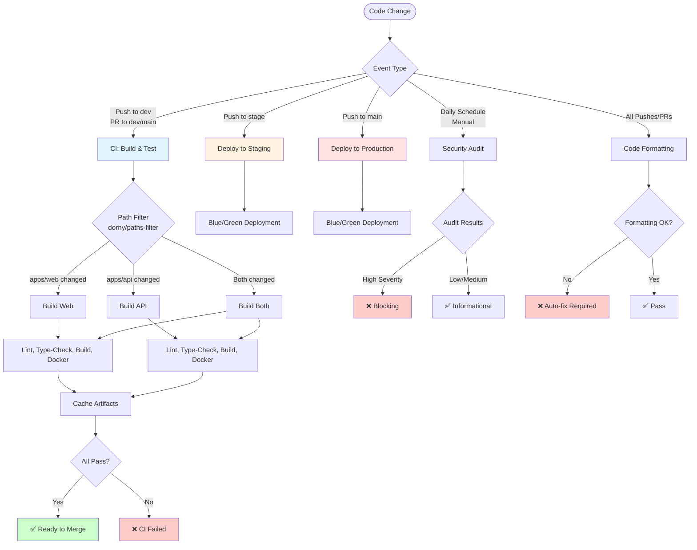
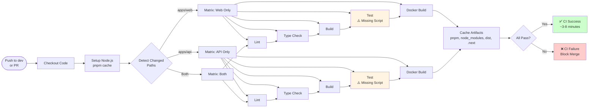
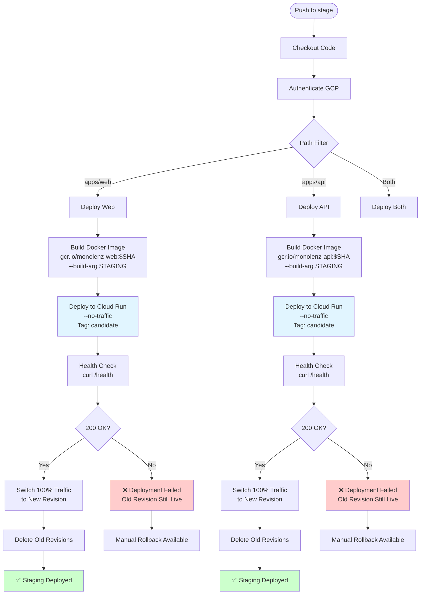
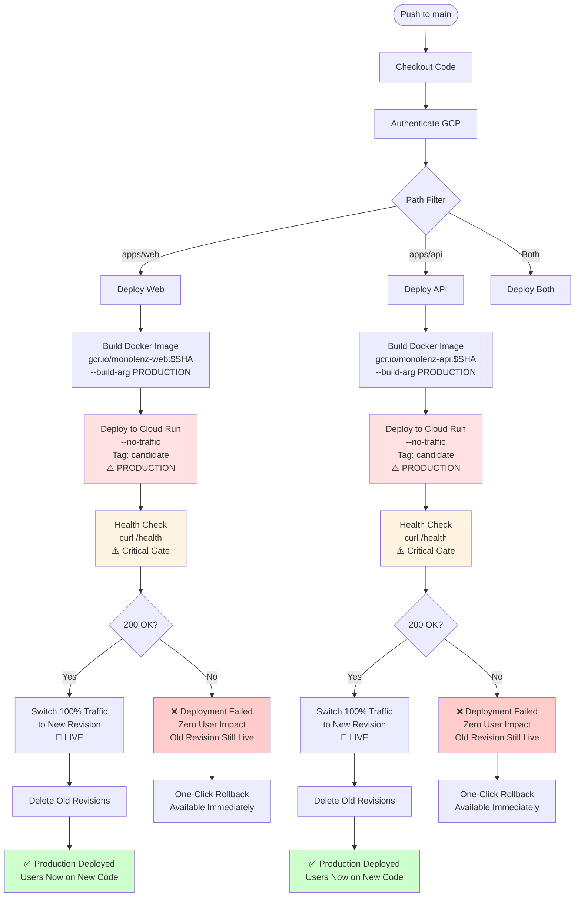
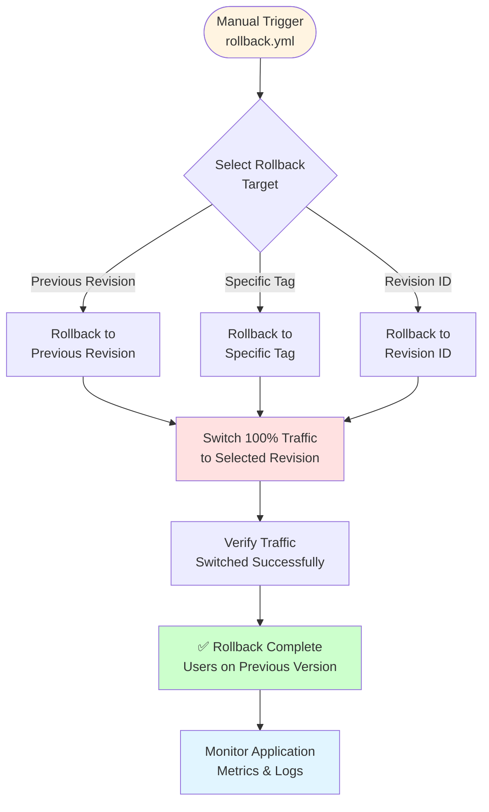
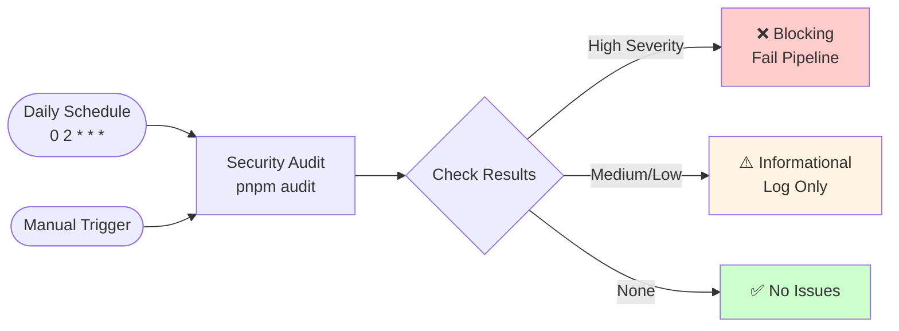

# CI/CD Pipeline Flow Diagrams

This document contains visual flow diagrams for the Athaar CI/CD pipeline based on the comprehensive analysis.

## Table of Contents

1. [Overall Pipeline Overview](#overall-pipeline-overview)
2. [CI Workflow (Build & Test)](#ci-workflow-build--test)
3. [Staging Deployment (Blue/Green)](#staging-deployment-bluegreen)
4. [Production Deployment (Blue/Green)](#production-deployment-bluegreen)
5. [Rollback Process](#rollback-process)
6. [Scheduled Jobs](#scheduled-jobs)

---

## Overall Pipeline Overview

---

## CI Workflow (Build & Test)

---

## Staging Deployment (Blue/Green)

---

## Production Deployment (Blue/Green)

---

## Rollback Process

---

## Scheduled Jobs

---

## Key Pipeline Characteristics

### Confidence Levels

| Stage          | What We're Confident About                                                                   | What We're NOT Confident About                       |
| -------------- | -------------------------------------------------------------------------------------------- | ---------------------------------------------------- |
| **CI**         | ✅ Code follows linting rules ✅ Code compiles (types correct) ✅ Application builds | ❌ Business logic works (no unit tests)              |
| **Staging**    | ✅ Application starts up ✅ Health endpoint responds                                     | ❌ Business logic works ❌ Integration scenarios |
| **Production** | ✅ Application starts up ✅ Health endpoint responds ✅ Zero downtime deployment     | ❌ Business logic works ❌ Edge cases            |

### Deployment Safety Features

- ✅ **Blue/Green Deployment**: New revision deployed with zero traffic initially
- ✅ **Health Check Gate**: Traffic only switched after successful health check
- ✅ **Automatic Rollback**: Failed deployments never receive traffic
- ✅ **One-Click Rollback**: Manual rollback workflow available
- ✅ **Zero Blast Radius**: Failed deployments have zero user impact

### Critical Gaps

- ⚠️ **Missing Unit Tests**: Test scripts not defined in package.json
- ⚠️ **No Integration Tests**: End-to-end scenarios not validated
- ⚠️ **Limited Observability**: Basic metrics only (New Relic for API, Cloud Run defaults)
- ⚠️ **No Notification System**: Failures only visible in GitHub Actions

---

## Pipeline Metrics

| Metric                  | Value         | Notes                                |
| ----------------------- | ------------- | ------------------------------------ |
| **CI Duration**         | ~3-8 minutes  | Depends on cache hits                |
| **Deployment Duration** | ~5-10 minutes | Includes build, deploy, health check |
| **Rollback Time**       | < 1 minute    | One-click rollback                   |
| **MTTR**                | Low           | Fast rollback capability             |
| **Cost per Run**        | Low           | Standard GitHub Actions minutes      |

---

## Environment Configuration

### Staging

- **Build Args**: `NEXT_PUBLIC_API_URL` (staging URL)
- **Runtime**: Cloud Run with staging secrets
- **Purpose**: Pre-production validation

### Production

- **Build Args**: `NEXT_PUBLIC_API_URL` (production URL)
- **Runtime**: Cloud Run with production secrets
- **Purpose**: Live user traffic

---

_Last Updated: Based on comprehensive pipeline analysis_
