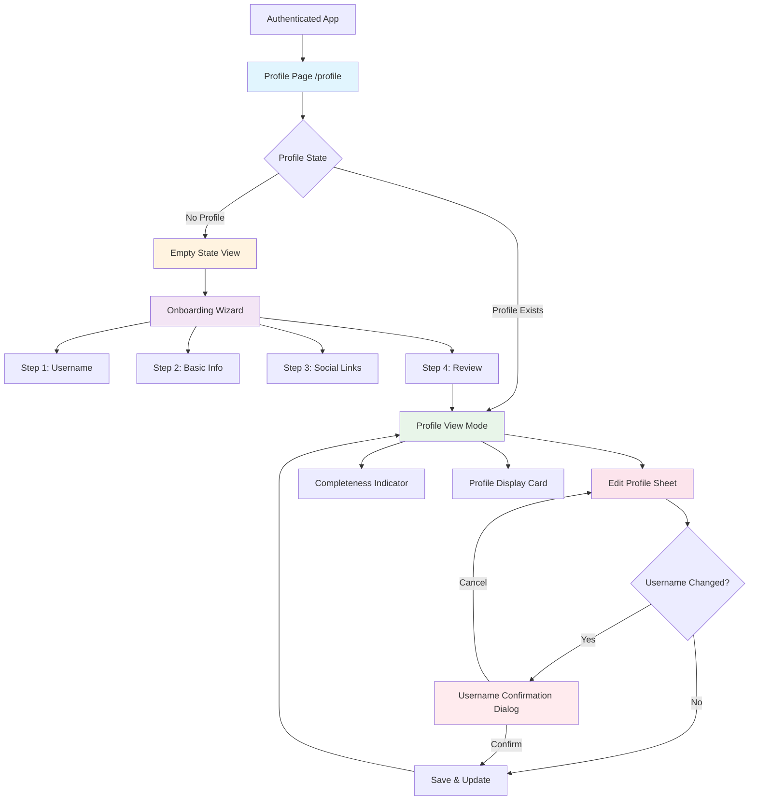
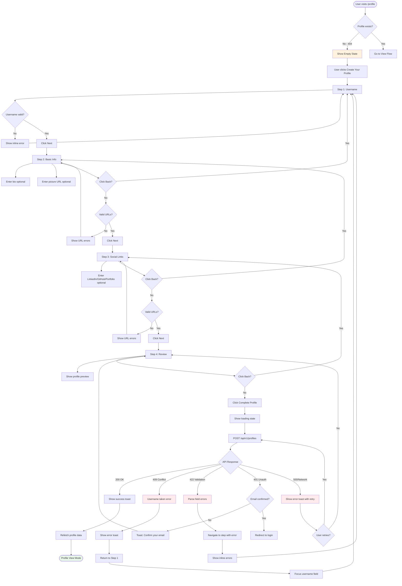
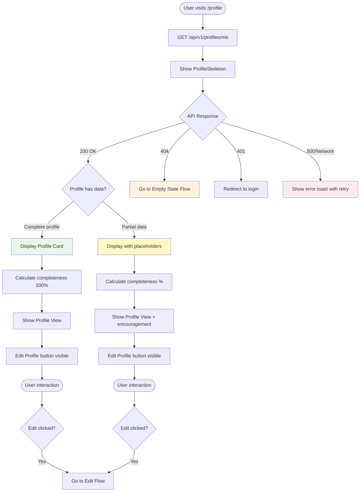
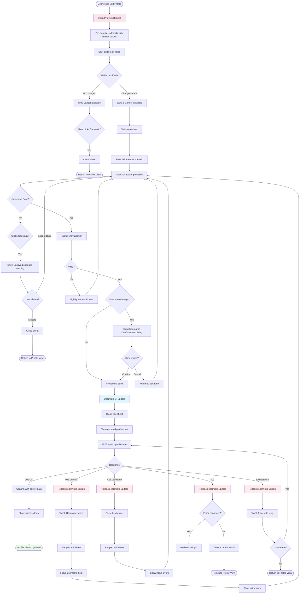
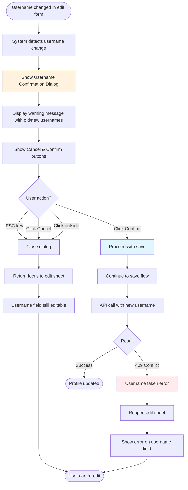

# Athaar Profile Management UI - UI/UX Specification

**Version:** 1.0  
**Date:** October 9, 2025  
**Author:** Sally (UX Expert)  
**Status:** Ready for Review

---

## Change Log

| Date | Version | Description | Author |
|------|---------|-------------|--------|
| 2025-10-09 | 1.0 | Initial UI/UX specification for Profile Management | Sally (UX Expert) |

---

## Introduction

This document defines the user experience goals, information architecture, user flows, and visual design specifications for Athaar Profile Management UI's user interface. It serves as the foundation for visual design and frontend development, ensuring a cohesive and user-centered experience.

---

## 1. Overall UX Goals & Principles

### 1.1 Target User Personas

**1. New User (First-Time Profile Creator)**
- Just signed up for Athaar and needs to establish their identity
- May be unfamiliar with profile systems
- Needs clear guidance and encouragement
- Values: Simplicity, clear instructions, minimal friction

**2. Active User (Profile Manager)**
- Has an existing profile and returns to update information
- Comfortable with the interface
- Needs quick access to edit functions
- Values: Efficiency, immediate feedback, control

**3. Incomplete Profile User**
- Started profile creation but hasn't completed all fields
- May need motivation to complete their profile
- Values: Clear progress indicators, understanding of benefits

---

### 1.2 Usability Goals

1. **Ease of Learning:** New users can complete profile creation within 3-5 minutes with zero external guidance
2. **Efficiency of Use:** Existing users can update any profile field in under 30 seconds
3. **Error Prevention:** Real-time validation prevents submission failures; confirmation dialogs protect against accidental destructive changes (username modification)
4. **Immediate Feedback:** Optimistic UI updates provide instant visual confirmation; loading states prevent user uncertainty
5. **Memorability:** Infrequent users can return and edit their profile without relearning the interface
6. **Completeness Motivation:** Visual progress indicators encourage users to complete optional fields

---

### 1.3 Design Principles

1. **Progressive Onboarding over Overwhelm** - Break complex profile creation into digestible steps (4-step wizard) rather than showing all fields at once
2. **Optimism with Safety Nets** - Use optimistic UI updates for instant feedback, but always provide rollback mechanisms and clear error recovery
3. **Clarity over Decoration** - Prioritize clear labels, helper text, and validation messages over aesthetic embellishment
4. **Encourage, Don't Nag** - Show completeness progress as opportunity ("Add LinkedIn to improve your profile") rather than deficit ("Your profile is incomplete")
5. **Mobile-First Responsive** - Design for 320px screens first, enhance for larger viewports (bottom sheets on mobile, side sheets on desktop)

---

## 2. Information Architecture (IA)

### 2.1 Site Map / Screen Inventory



---

### 2.2 Navigation Structure

**Primary Navigation:**  
Profile management lives within the `(app)` authenticated route group. Users access `/profile` from the existing dashboard navigation/header. The profile page is a destination, not a hub - users come here with clear intent (view/edit profile).

**Secondary Navigation:**  
Within the profile page, navigation is task-based rather than hierarchical:
- Empty state → "Create Your Profile" CTA
- Profile view → "Edit Profile" button
- Onboarding wizard → Step-based progression (Back/Next buttons with visual step indicator "Step 2 of 4")
- Edit sheet → Modal overlay (no navigation, just Save/Cancel actions)

**Breadcrumb Strategy:**  
Not required for profile management. The page is a single-level destination within the authenticated app. Users can return to dashboard via existing header navigation. Breadcrumbs would add visual noise without functional benefit.

---

## 3. User Flows

### 3.1 Flow 1: Profile Creation (First-Time User Onboarding)

**User Goal:** Create initial profile to establish identity on Athaar platform

**Entry Points:** 
- User navigates to `/profile` after signup/login
- API returns 404 (no profile exists)
- Empty state "Create Your Profile" CTA clicked

**Success Criteria:** 
- Profile created with valid username and saved to database
- User sees profile view with completeness indicator
- Success toast notification displayed

#### Flow Diagram



#### Edge Cases & Error Handling:

- **Wizard abandonment:** User navigates away mid-flow → Wizard state resets on return (no persistence across sessions)
- **Session timeout during wizard:** Token expires before completion → Show auth error, redirect to login, lose wizard progress
- **Network interruption:** API call fails → Show retry option, maintain wizard state, don't reset form data
- **Username conflict at final step:** 409 error → Navigate back to Step 1, focus username field, preserve other entered data
- **Validation mismatch:** Backend rejects data that passed client validation → Highlight affected step in wizard, show specific errors
- **Partial form data:** User completes Step 1-2, closes browser → Next visit starts fresh wizard (no localStorage persistence in MVP)

---

### 3.2 Flow 2: Profile Viewing

**User Goal:** View complete profile information and assess completeness

**Entry Points:**
- Profile exists in database
- After successful profile creation
- After successful profile update
- Direct navigation to `/profile`

**Success Criteria:**
- All profile fields displayed correctly
- Completeness percentage calculated and shown
- Social links functional and open in new tabs
- Edit button accessible

#### Flow Diagram



#### Edge Cases & Error Handling:

- **Empty optional fields:** Display "No bio added" placeholders in muted text (not blank/broken UI)
- **Invalid cached data:** After page load, if profile data seems stale → Provide manual refresh option
- **Broken image URLs:** Profile picture fails to load → Show default avatar placeholder, don't break layout
- **Social link domain validation:** User entered valid URL format but wrong domain → Display as-is (backend doesn't validate domains)
- **Very long bio/username:** Content exceeds typical display area → Truncate with "Read more" or ensure scrollable container
- **Completeness calculation error:** Missing fields in calculation logic → Default to showing raw data without percentage

---

### 3.3 Flow 3: Profile Editing

**User Goal:** Update profile information quickly and confidently

**Entry Points:**
- User clicks "Edit Profile" button from Profile View
- After error in previous edit attempt (sheet reopens)

**Success Criteria:**
- Changes saved successfully to database
- Optimistic UI update provides immediate feedback
- Validation errors shown inline before submission
- Sheet closes after successful save

#### Flow Diagram



#### Edge Cases & Error Handling:

- **Mid-edit session timeout:** Token expires while form open → On save, show auth error, don't lose form data
- **Concurrent edits:** User has profile open in two tabs, edits in both → Last write wins (no conflict detection in MVP)
- **Invalid URL formats:** User enters URL without https:// → Client validation catches, shows format helper
- **Extremely long inputs:** User pastes 10,000 character bio → Character counter prevents submission
- **Whitespace-only inputs:** User enters spaces in bio → Transform to undefined, treated as empty
- **Sheet close during API call:** User closes sheet while save in progress → Allow close, continue API call, show toast on completion

---

### 3.4 Flow 4: Username Change Confirmation

**User Goal:** Safely change username with full understanding of implications

**Entry Points:**
- User modifies username field in edit form and clicks Save

**Success Criteria:**
- User makes informed decision about username change
- Canceling returns to edit form without data loss
- Confirming proceeds with save and appropriate error handling

#### Flow Diagram



#### Edge Cases & Error Handling:

- **Username unchanged but whitespace differs:** Normalize before comparison, don't trigger dialog if functionally same
- **Case-only change:** "johndoe" to "JohnDoe" → Still considered a change (database is case-sensitive), show confirmation
- **Rapid dialog dismissal:** User immediately hits ESC → Allow instant dismiss, no confirmation timeout
- **Multiple username changes:** User changes, cancels, changes again → Dialog shows latest old→new comparison each time

---

## 4. Wireframes & Mockups

### 4.1 Primary Design Files

**Recommended Design Tool:** Figma (shareable, supports component libraries, real-time collaboration)

**File Structure:**
```
Athaar Profile Management UI
├── 📄 Page: Onboarding Flow (4 frames)
├── 📄 Page: Profile View States (3 frames: empty, partial, complete)
├── 📄 Page: Edit Experience (sheet + dialog)
├── 📄 Page: Mobile Adaptations
└── 🎨 Components: Profile UI Kit (shared components)
```

**Design File Link:** *[To be created - placeholder for Figma project link]*

---

### 4.2 Key Screen Layouts

#### Screen 1: Empty Profile State

**Purpose:** Welcome new users and guide them to create their first profile

**Key Elements:**
- Hero section with welcome heading and descriptive subtext
- Benefits list with icon + text cards
- Primary CTA: "Create Your Profile" button
- Empty state illustration

**Layout Structure:**
```
┌─────────────────────────────────────────┐
│        [Dashboard Header/Nav]           │
├─────────────────────────────────────────┤
│                                         │
│          [Empty State Icon]             │
│                                         │
│        Welcome to Your Profile          │
│                                         │
│    Your profile helps others discover   │
│      and connect with you on Athaar     │
│                                         │
│  ┌─────────────────────────────────┐   │
│  │  🎯 Stand out with a complete   │   │
│  │     professional profile        │   │
│  └─────────────────────────────────┘   │
│  ┌─────────────────────────────────┐   │
│  │  🔗 Share your work and         │   │
│  │     social links                │   │
│  └─────────────────────────────────┘   │
│  ┌─────────────────────────────────┐   │
│  │  📊 Track your profile          │   │
│  │     completeness                │   │
│  └─────────────────────────────────┘   │
│                                         │
│      [ Create Your Profile ]            │
│                                         │
└─────────────────────────────────────────┘
```

---

#### Screen 2: Onboarding Wizard - Step 1 (Username)

**Purpose:** Focused username selection as first critical step

**Key Elements:**
- Progress indicator (Step 1 of 4)
- Username input with validation
- Character counter (0/50)
- Format hint text
- Next button (disabled until valid)

**Layout Structure:**
```
┌─────────────────────────────────────────┐
│        [Dashboard Header/Nav]           │
├─────────────────────────────────────────┤
│                                         │
│   Step 1 of 4    ●────○────○────○      │
│                                         │
│        Choose Your Username             │
│                                         │
│   This will be your unique identifier   │
│   on Athaar. Choose wisely - it can be  │
│   changed later.                        │
│                                         │
│   Username *                            │
│   ┌─────────────────────────────────┐  │
│   │ e.g., john_developer        [✓] │  │
│   └─────────────────────────────────┘  │
│                               15/50     │
│   3-50 characters: letters, numbers,    │
│   underscores, and hyphens only         │
│                                         │
│                                         │
│                                         │
│                  [ Next: Basic Info ]   │
│                                         │
└─────────────────────────────────────────┘
```

---

#### Screen 3: Profile View - Complete Profile

**Purpose:** Display user's profile with all information and completeness indicator

**Layout Structure:**
```
┌─────────────────────────────────────────┐
│        [Dashboard Header/Nav]           │
├─────────────────────────────────────────┤
│                                         │
│  ┌──────────────────────────────────┐  │
│  │  [Avatar]                        │  │
│  │            john_developer  [Edit]│  │
│  │                                  │  │
│  │  Passionate developer building   │  │
│  │  amazing web experiences with    │  │
│  │  React and TypeScript            │  │
│  │                                  │  │
│  │  [in] [gh] [🌐]                 │  │
│  └──────────────────────────────────┘  │
│                                         │
│  Profile Completeness                   │
│  ┌──────────────────────────────────┐  │
│  │ ████████████████████████░░ 83%   │  │
│  │                                  │  │
│  │ ✓ Username                       │  │
│  │ ✓ Bio                            │  │
│  │ ✓ Profile Picture                │  │
│  │ ✓ LinkedIn                       │  │
│  │ ✓ GitHub                         │  │
│  │ ✗ Portfolio  → Add to complete   │  │
│  └──────────────────────────────────┘  │
│                                         │
└─────────────────────────────────────────┘
```

---

#### Screen 4: Edit Profile Sheet (Modal)

**Purpose:** Focused editing experience as overlay

**Layout Structure (Desktop):**
```
┌────────────────┬────────────────────────┐
│                │ Edit Profile        [X]│
│                ├────────────────────────┤
│                │                        │
│  Profile View  │ Username *             │
│  (Dimmed)      │ ┌────────────────────┐ │
│                │ │ john_developer     │ │
│                │ └────────────────────┘ │
│                │                  14/50 │
│                │                        │
│                │ Bio                    │
│                │ ┌────────────────────┐ │
│                │ │ Passionate...      │ │
│                │ │                    │ │
│                │ └────────────────────┘ │
│                │                 120/500│
│                │                        │
│                │ [... more fields ...]  │
│                │                        │
│                ├────────────────────────┤
│                │ [ Cancel ] [ Save ]    │
└────────────────┴────────────────────────┘
```

---

#### Screen 5: Username Change Confirmation Dialog

**Purpose:** Protect users from unintended username changes

**Layout Structure:**
```
┌─────────────────────────────────────────┐
│  ┌───────────────────────────────────┐  │
│  │                                   │  │
│  │           ⚠️                      │  │
│  │                                   │  │
│  │     Confirm Username Change       │  │
│  │                                   │  │
│  │  Changing your username from      │  │
│  │  'john_developer' to 'johndoe'    │  │
│  │  may affect your profile URL and  │  │
│  │  how others find you. This action │  │
│  │  cannot be easily undone.         │  │
│  │                                   │  │
│  │  Are you sure you want to         │  │
│  │  continue?                        │  │
│  │                                   │  │
│  │  [ Cancel ] [ Yes, Change ]       │  │
│  │                                   │  │
│  └───────────────────────────────────┘  │
└─────────────────────────────────────────┘
```

---

## 5. Component Library / Design System

### 5.1 Design System Approach

**Strategy:** Leverage existing Radix UI + Tailwind CSS foundation with profile-specific component extensions

Athaar already uses Radix UI primitives with Tailwind CSS styling. Rather than creating an entirely new design system:

1. **Extend existing primitives** - Create profile-specific compositions
2. **Maintain consistency** - Follow established patterns from auth forms
3. **Document variants** - Define profile-specific variants
4. **Ensure accessibility** - Leverage Radix UI's built-in ARIA attributes

**Existing Foundation:**
- Component Library: Radix UI (`components/ui/`)
- Styling System: Tailwind CSS v4.1.11
- Color Palette: CSS variables (primary, secondary, destructive, muted, success)
- Typography: Existing heading/body scale

**New Profile Components:**
Located in `apps/web/components/profile/`:
- ProfileCard, ProfileEditSheet, ProfileOnboardingWizard
- EmptyProfileState, CompletenessIndicator, UsernameChangeDialog

---

### 5.2 Core Components

#### Component 1: Button (Existing - Profile Usage)

**Variants:**
- `default` - Main actions (Create Profile, Save Changes)
- `secondary` - Cancel actions, Back navigation
- `outline` - Edit Profile button
- `ghost` - Subtle actions, icon buttons

**States:** Default, Hover, Focus, Active, Disabled, Loading

**Usage Guidelines:**
- Primary actions use `default` variant (max one per screen section)
- Loading state maintains button text + spinner
- Minimum touch target: 44px height on mobile

---

#### Component 2: Input (Existing)

**Variants:** `default`, `error`, `success`

**States:** Default, Focus, Error, Success, Disabled, Loading

**Usage Guidelines:**
- Always pair with Label component
- Error messages below input via aria-describedby
- Character counters right-aligned below input

---

#### Component 3: Sheet (Existing - Edit Usage)

**Variants:**
- `right` (desktop) - 480px wide
- `bottom` (mobile) - 80% viewport height

**Usage Guidelines:**
- Focus trap: Tab cycles through sheet only
- ESC key closes (with unsaved check)
- Backdrop click closes (with unsaved check)

---

#### Component 4: AlertDialog (Username Confirmation)

**Usage Guidelines:**
- Use for critical confirmations only
- Warning icon for cautionary actions
- Action buttons must be specific ("Yes, Change Username")
- Cancel is safer default (focused first)

---

#### Component 5: Progress (Completeness Indicator)

**Usage Guidelines:**
- Animate fill level changes (500ms smooth transition)
- Show percentage text alongside bar
- Success color when 100%, primary for partial
- Always accompany with text explanation

---

#### Component 6: ProfileCard (New Composition)

**Variants:** `view`, `preview`

**Key Sub-components:**
- Avatar, Username heading, Bio text, Social link buttons, Edit button

**Usage Guidelines:**
- Avatar loads lazily with fallback
- Social links only render if URLs exist
- Bio truncates after 3 lines with ellipsis

---

#### Component 7: CompletenessIndicator (New)

**Variants:** `expanded`, `compact`

**Calculation:** 
- Username (required) + 5 optional fields = 6 total
- Each filled field = 16.67%

**Usage Guidelines:**
- Missing field suggestions are clickable → open edit sheet
- Use encouraging language ("Add X to improve")

---

#### Component 8: ProfileOnboardingWizard (New)

**States:** Step 1-4, Submitting

**Usage Guidelines:**
- Linear progression (can't skip steps)
- Step data preserved when navigating backward
- Error on submit navigates to step with error

---

#### Component 9: Toast Notifications (Existing - Sonner)

**Variants:** `success`, `error`, `info`

**Usage Guidelines:**
- Auto-dismiss after 4 seconds (unless action button)
- Max 3 toasts visible at once
- Position: Top-right desktop, top-center mobile

---

### 5.3 Color CSS Variables (Explicit)

| Variable | Usage in Profile UI |
|----------|---------------------|
| `--primary` | Primary buttons, focus rings, active states |
| `--primary-foreground` | Text on primary buttons |
| `--secondary` | Secondary buttons, subtle backgrounds |
| `--secondary-foreground` | Text on secondary buttons |
| `--destructive` | Error states, validation errors |
| `--destructive-foreground` | Text in error messages |
| `--success` (hsl(142, 76%, 36%)) | Valid inputs, 100% completeness, checkmarks |
| `--success-foreground` (hsl(0, 0%, 100%)) | Text on success elements |
| `--warning` (hsl(38, 92%, 50%)) | Warning icon in username dialog |
| `--warning-foreground` (hsl(48, 96%, 89%)) | Text on warning elements |
| `--muted` | Placeholder text, disabled states, skeletons |
| `--muted-foreground` | Helper text, character counters |
| `--border` | Input borders, card borders, dividers |
| `--input` | Input field borders (default) |
| `--ring` | Focus rings (keyboard navigation) |
| `--background` | Page background |
| `--foreground` | Primary text color |

**Social Platform Colors:**
- LinkedIn: `#0A66C2`
- GitHub: `#181717` (light mode), `#FFFFFF` (dark mode)
- Portfolio: `var(--primary)`

---

## 6. Branding & Style Guide

### 6.1 Visual Identity

**Brand Guidelines:** Athaar follows existing application patterns with profile-specific refinements

**Design Language:** Modern, clean, professional with emphasis on clarity

**Key Brand Attributes:**
- Professional (suitable for career/portfolio)
- Approachable (not intimidating)
- Trustworthy (clear communication)
- Efficient (respects user time)

---

### 6.2 Typography

#### Font Families

- **Primary (UI):** `Inter, -apple-system, BlinkMacSystemFont, "Segoe UI", Roboto, sans-serif`
- **Monospace:** `"JetBrains Mono", "Fira Code", Consolas, monospace`

#### Type Scale

| Element | Size | Weight | Line Height | Usage |
|---------|------|--------|-------------|-------|
| **H2** | 1.875rem (30px) | 600 | 1.3 | Section headings (Choose Your Username) |
| **H3** | 1.5rem (24px) | 600 | 1.4 | Dialog titles (Edit Profile) |
| **H4** | 1.25rem (20px) | 600 | 1.5 | Card titles |
| **Body** | 1rem (16px) | 400 | 1.5 | Primary text |
| **Body Small** | 0.875rem (14px) | 400 | 1.5 | Character counters, helper text |
| **Button** | 0.875rem (14px) | 500 | 1 | Button text |
| **Label** | 0.875rem (14px) | 500 | 1.5 | Form labels |

**Mobile Base Size:** 16px minimum (prevents iOS zoom)

---

### 6.3 Iconography

**Icon Library:** Lucide React (v0.263.1+)

**Icon Usage:**

| Icon | Context | Size | Color |
|------|---------|------|-------|
| `user-circle` | Default avatar | 80-120px | `muted` |
| `check-circle` | Valid username | 20px | `success` |
| `x-circle` | Invalid input | 20px | `destructive` |
| `loader-2` | Loading spinner | 16-20px | `muted-foreground` (animated) |
| `alert-triangle` | Warning (username dialog) | 48px | `warning` |
| `linkedin` | LinkedIn link | 20px | `#0A66C2` |
| `github` | GitHub link | 20px | `foreground` |
| `globe` | Portfolio link | 20px | `primary` |
| `edit` | Edit button | 16px | `foreground` |

**Usage Guidelines:**
- Consistent sizing: 16px (small), 20px (medium), 24px (large)
- Stroke width: 2px default
- Never use icons alone without text or aria-label
- Loading animations use `animate-spin` utility

---

### 6.4 Spacing & Layout

**Grid System:** 12-column responsive grid (Tailwind default)

**Container Max Widths:**
- Mobile: Full width (100vw - 32px padding)
- Tablet: 720px
- Desktop: 960px
- Wide: 1140px

**Spacing Scale:**

| Token | Value | Usage |
|-------|-------|-------|
| `spacing-2` | 8px | Form field internal padding |
| `spacing-4` | 16px | Standard gap between fields, card padding (mobile) |
| `spacing-6` | 24px | Section spacing, card padding (desktop) |
| `spacing-8` | 32px | Large section gaps, wizard step spacing |
| `spacing-12` | 48px | Major section dividers |

---

### 6.5 Animation & Motion

**Motion Principles:**
- Purposeful (every animation serves a function)
- Subtle (200-400ms sweet spot)
- Respectful (honor `prefers-reduced-motion`)

**Timing Functions:**

| Name | Cubic Bezier | Usage |
|------|--------------|-------|
| `ease-in` | `cubic-bezier(0.4, 0, 1, 1)` | Elements exiting |
| `ease-out` | `cubic-bezier(0, 0, 0.2, 1)` | Elements entering (most common) |
| `ease-in-out` | `cubic-bezier(0.4, 0, 0.2, 1)` | State transitions |

**Duration Scale:**

| Duration | Value | Usage |
|----------|-------|-------|
| `fast` | 150ms | Button hover, focus ring |
| `base` | 300ms | Sheet open/close, toast enter/exit |
| `moderate` | 500ms | Progress bar fills |
| `slow` | 700ms | Loading states, skeleton shimmer |

**Key Animations:**

```css
/* Sheet slide-in from right (desktop) */
@keyframes slide-in-right {
  from { transform: translateX(100%); }
  to { transform: translateX(0); }
}

/* Sheet slide-in from bottom (mobile) */
@keyframes slide-in-bottom {
  from { transform: translateY(100%); }
  to { transform: translateY(0); }
}

/* Loading spinner */
@keyframes spin {
  from { transform: rotate(0deg); }
  to { transform: rotate(360deg); }
}

/* Skeleton shimmer */
@keyframes shimmer {
  0% { background-position: -1000px 0; }
  100% { background-position: 1000px 0; }
}
```

**Reduced Motion:**
```css
@media (prefers-reduced-motion: reduce) {
  *, *::before, *::after {
    animation-duration: 0.01ms !important;
    transition-duration: 0.01ms !important;
  }
}
```

---

## 7. Accessibility Requirements

### 7.1 Compliance Target

**Standard:** WCAG 2.1 Level AA

**Scope:** All profile management UI components and flows

**Verification:** Manual testing + automated tools (axe DevTools, Lighthouse)

---

### 7.2 Key Requirements

#### Visual Accessibility

**Color Contrast:**
- Normal text: 4.5:1 minimum
- Large text: 3:1 minimum
- UI components: 3:1 minimum

**Focus Indicators:**
- 2px solid, high contrast (use `--ring` color)
- Never remove without alternative
- All interactive elements must show focus

**Text Sizing:**
- 16px minimum on mobile (prevents iOS auto-zoom)
- Interface usable at 200% zoom
- Use relative units (rem) where possible

---

#### Interaction Accessibility

**Keyboard Navigation:**
- Logical tab order matching visual layout
- Enter submits forms
- ESC closes modals/sheets
- Focus trap in modals (Tab cycles within)
- Focus return when sheet closes

**Screen Reader Support:**
- All interactive elements have accessible names
- ARIA live regions for dynamic content
- Error messages associated via aria-describedby
- Form labels for all inputs

**Touch Targets:**
- 44x44px minimum (WCAG 2.5.5)
- 8px minimum spacing between targets
- Full-width buttons on mobile where appropriate

---

#### Content Accessibility

**Alternative Text:**
- Avatar images: `alt="[Username]'s profile picture"`
- Default avatar: `alt="Default avatar"`
- Platform icons: `aria-hidden="true"` (label provides context)

**Heading Structure:**
- Logical hierarchy (no skipped levels)
- Single H1 per page (dashboard provides)
- H2 for sections, H3 for modals

**Form Labels:**
- Visible labels for all inputs
- Required indicators (asterisk or text)
- Helper text associated via aria-describedby

---

### 7.3 Testing Strategy

**Automated Testing:**
- Lighthouse CI: 95/100 minimum score
- axe DevTools: Zero critical violations
- ESLint: `eslint-plugin-jsx-a11y`

**Manual Testing:**
- Keyboard-only navigation (all flows)
- Screen reader testing (VoiceOver/NVDA)
- 200% zoom testing
- Color blindness simulation

**Compliance Checklist:**
- [ ] All images have alt text
- [ ] All interactive elements keyboard accessible
- [ ] Focus indicators visible
- [ ] Color contrast meets requirements
- [ ] Form fields have labels
- [ ] Error messages announced
- [ ] Heading hierarchy logical
- [ ] Modal focus traps work
- [ ] ESC closes modals
- [ ] Interface usable at 200% zoom
- [ ] Animations respect `prefers-reduced-motion`
- [ ] Touch targets 44x44px minimum

---

## 8. Responsiveness Strategy

### 8.1 Breakpoints

| Breakpoint | Min Width | Max Width | Target Devices |
|------------|-----------|-----------|----------------|
| **Mobile** | 320px | 767px | iPhone SE, Android phones |
| **Tablet** | 768px | 1023px | iPad, Android tablets |
| **Desktop** | 1024px | 1439px | Laptops, desktops |
| **Wide** | 1440px | - | Large monitors (same as desktop) |

---

### 8.2 Adaptation Patterns

#### Layout Changes

**Profile Card:**
- Mobile: Avatar centered, 80px; username centered; social icon-only; edit full-width
- Tablet: Avatar left 100px; username left-aligned; social icon+label; edit top-right
- Desktop: Avatar left 120px; username 32px font; social with hover; edit top-right

**Onboarding Wizard:**
- Mobile: Full-width, dots only progress, buttons stacked
- Tablet: 600px centered, connected dots, buttons inline
- Desktop: 480px centered, full stepper, buttons inline

**Completeness Indicator:**
- Mobile: Collapsed by default (tap to expand)
- Desktop: Always expanded

---

#### Navigation Changes

**Edit Sheet:**
- Mobile: Slides from bottom, 85% viewport height, swipe-down dismiss
- Desktop: Slides from right, 480px width, ESC dismiss

**Wizard Navigation:**
- Mobile: Full-width buttons stacked (Back top, Next bottom sticky)
- Desktop: Inline buttons (Back left, Next right)

---

#### Interaction Changes

**Touch vs. Mouse:**
- Mobile: 44x44px targets, no hover, tap feedback, swipe gestures, long-press tooltips
- Desktop: Standard sizes, hover enabled, click feedback, keyboard shortcuts, hover tooltips

**Input Methods:**
- Mobile: Virtual keyboard optimization, `inputmode` attributes, autofill support
- Desktop: Physical keyboard, Tab order, Enter/ESC, copy/paste

---

### 8.3 Responsive Testing Checklist

**Devices:**
- [ ] iPhone SE (375x667)
- [ ] iPhone 12/13 (390x844)
- [ ] iPad (768x1024)
- [ ] Laptop 13" (1280x800)
- [ ] Desktop 1080p (1920x1080)

**Orientations:**
- [ ] Mobile portrait (optimized)
- [ ] Mobile landscape (usable)
- [ ] Tablet portrait/landscape

**Edge Cases:**
- [ ] 320px width minimum
- [ ] Browser zoom at 200%
- [ ] Split-screen view (iPad)

---

## 9. Performance Considerations

### 9.1 Performance Goals

| Metric | Target | Notes |
|--------|--------|-------|
| **Page Load** | < 2s | API call + render on 4G |
| **Interaction Response** | < 100ms | Optimistic updates |
| **Animation FPS** | 60fps | All animations smooth |
| **Bundle Size** | < 50KB gzipped | Profile-specific components |

---

### 9.2 Design Strategies

#### 1. Skeleton Loading States
- Show layout placeholders immediately
- Match exact dimensions of loaded content
- Eliminates flash of unstyled content
- Minimum 300ms display time

#### 2. Optimistic UI Updates
- Update UI instantly on user action
- API call in background
- Rollback on error with clear messaging
- Zero perceived latency for successful operations

#### 3. Lazy Loading Heavy Components
- Edit sheet loads only when needed
- Wizard eager-loaded (primary flow)
- ~30KB saved on initial page load
- Acceptable +100-200ms on first edit

#### 4. Image Optimization
- Lazy load avatars (`loading="lazy"`)
- Default avatar is SVG (tiny size)
- Broken URLs fallback to placeholder
- Explicit dimensions prevent layout shift

#### 5. Debounced API Calls
- Username availability check: 500ms debounce
- Prevents API spam (1 call instead of 7 while typing)
- Reduces server load by ~80%

#### 6. Form Validation Timing
- Validate on blur, not every keystroke
- Character counter updates in real-time (cheap)
- Final validation on submit

#### 7. CSS Animations (GPU-Accelerated)
- Use transforms, not layout properties
- 60fps smooth on all devices
- Zero JavaScript execution during animation

#### 8. Modal/Sheet Rendering
- Sheet always in DOM (display: none when closed)
- Opens in 300ms (animation only, no render)
- Minimal memory cost for better UX

---

### 9.3 Performance Monitoring

**Core Web Vitals:**
- LCP (Largest Contentful Paint): < 2.5s
- FID (First Input Delay): < 100ms
- CLS (Cumulative Layout Shift): < 0.1

**Development Monitoring:**
```bash
# Lighthouse CI
npm run lighthouse -- --url=/profile

# Bundle analysis
npm run analyze
```

---

## 10. Next Steps

### 10.1 Immediate Actions

1. **Stakeholder Review & Approval** (3 business days)
   - Review with Product Manager and Tech Lead
   - Get sign-off on 4-step wizard approach
   - Confirm WCAG 2.1 AA compliance target

2. **Create Visual Designs in Figma** (1-2 weeks)
   - Set up Figma project: "Athaar Profile Management UI"
   - Design all 7 key screens with states
   - Create mobile and desktop variants
   - Build component library

3. **Prototype Interactive Flows** (3-5 days)
   - Build Figma prototype for onboarding flow
   - Build edit flow prototype
   - Include error states in prototype

4. **Conduct Usability Testing** (1 week)
   - Recruit 5-8 users
   - Test onboarding and edit flows
   - Measure completion time, errors, satisfaction
   - Iterate based on findings

5. **Prepare Design Handoff Package** (2-3 days)
   - Export design specs from Figma
   - Document component variants
   - Create Figma Dev Mode links
   - Record walkthrough videos

6. **Collaborate with Design Architect**
   - Hand off for frontend architecture spec
   - Review component breakdown
   - Discuss state management approach
   - 2-hour working session scheduled

7. **Define Success Metrics & Analytics**
   - Set up event tracking
   - Define KPIs: >80% onboarding completion, >95% edit success
   - Owner: Product Manager + Analytics Team

8. **Accessibility Pre-Development Audit** (1 week)
   - Color contrast checker
   - Focus order validation
   - Create accessibility annotation layer

---

### 10.2 Design Handoff Checklist

**Documentation Complete:**
- [x] All user flows documented
- [x] Component inventory complete
- [x] Accessibility requirements defined
- [x] Responsive strategy clear
- [x] Brand guidelines incorporated
- [x] Performance goals established

**Design Assets Ready:**
- [ ] Figma designs created
- [ ] Mobile/desktop variants
- [ ] All component states designed
- [ ] Interactive prototype built
- [ ] Design tokens documented
- [ ] Icon assets specified

**User Validation:**
- [ ] Usability testing conducted
- [ ] Feedback incorporated
- [ ] Edge cases tested
- [ ] Accessibility tested

**Developer Handoff:**
- [ ] Figma Dev Mode links shared
- [ ] Component specs exported
- [ ] Animation specs documented
- [ ] API integration points noted
- [ ] Error handling documented
- [ ] Walkthrough video recorded

---

### 10.3 Open Questions & Decisions Needed

**Design:**
1. Dark mode in scope for this release?
2. Custom illustration or asset library for empty state?
3. Where does avatar upload fit in future onboarding?
4. Will usernames create public URLs (e.g., athaar.com/@username)?

**Technical:**
5. React Hook Form or Formik for form state?
6. How to integrate Zod schemas with form library?
7. Framer Motion or CSS for animations? (CSS recommended)
8. Toast position: top-right desktop, top-center mobile?

**Product:**
9. Can users skip onboarding? Mandatory on first login?
10. Delete profile button in UI? Where?
11. Username change frequency limit? (e.g., once per 30 days)
12. All profiles public or privacy controls needed?

**Analytics:**
13. Which specific events to track?
14. Send validation errors to analytics? (PII concerns)

---

### 10.4 Risks & Mitigations

**Risk: Onboarding Wizard Too Long**
- Impact: Users drop off before completion
- Mitigation: Usability testing validates 4 steps
- Contingency: Reduce to 3 steps or add "Save & Continue Later"

**Risk: Optimistic Updates Confuse Users**
- Impact: Users don't understand rollback
- Mitigation: Clear error messaging, auto sheet reopen
- Contingency: Add "Saving..." indicator

**Risk: Performance Targets Unmet**
- Impact: Poor experience on low-end devices
- Mitigation: Test on real devices, aggressive code-splitting
- Contingency: Simplified fallback UI

**Risk: Accessibility Compliance Gaps**
- Impact: Legal liability, excluding users
- Mitigation: Pre-dev audit, screen reader testing
- Contingency: Delay launch until violations resolved (non-negotiable)

---

### 10.5 Success Criteria

This specification is successful if:

✅ **User Goals:**
- New users complete onboarding in < 5 minutes
- Existing users edit any field in < 30 seconds
- >60% of users complete all profile fields

✅ **Technical Goals:**
- Page load < 2 seconds on 4G
- All interactions < 100ms perceived response
- WCAG 2.1 AA compliance (zero critical violations)
- 60fps animations

✅ **Business Goals:**
- Profile creation live within 6 weeks of dev start
- <5% error rate on submissions
- >85% user satisfaction score

---

## Document Status

**Status:** ✅ Ready for Stakeholder Review

**Next Action:** Schedule review meeting with Product Manager and Tech Lead

**Owner:** Sally (UX Expert)

---

**END OF SPECIFICATION**

