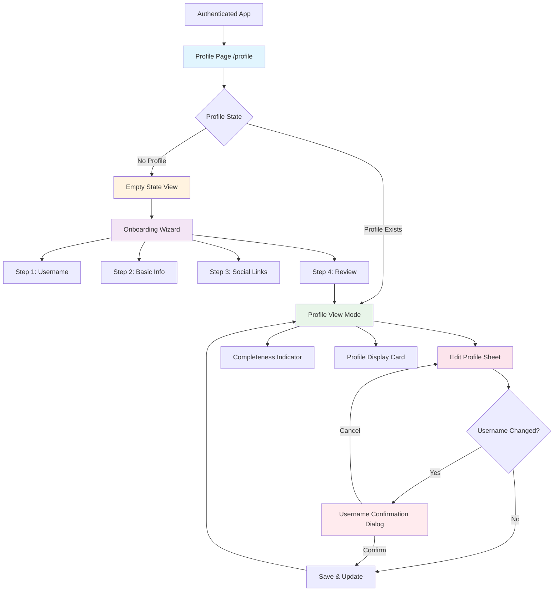

# 2. Information Architecture (IA)

## 2.1 Site Map / Screen Inventory

---

## 2.2 Navigation Structure

**Primary Navigation:**  
Profile management lives within the `(app)` authenticated route group. Users access `/profile` from the existing dashboard navigation/header. The profile page is a destination, not a hub - users come here with clear intent (view/edit profile).

**Secondary Navigation:**  
Within the profile page, navigation is task-based rather than hierarchical:
- Empty state → "Create Your Profile" CTA
- Profile view → "Edit Profile" button
- Onboarding wizard → Step-based progression (Back/Next buttons with visual step indicator "Step 2 of 4")
- Edit sheet → Modal overlay (no navigation, just Save/Cancel actions)

**Breadcrumb Strategy:**  
Not required for profile management. The page is a single-level destination within the authenticated app. Users can return to dashboard via existing header navigation. Breadcrumbs would add visual noise without functional benefit.

---

