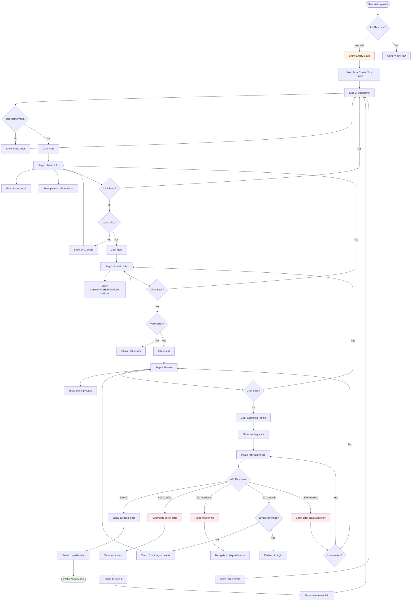
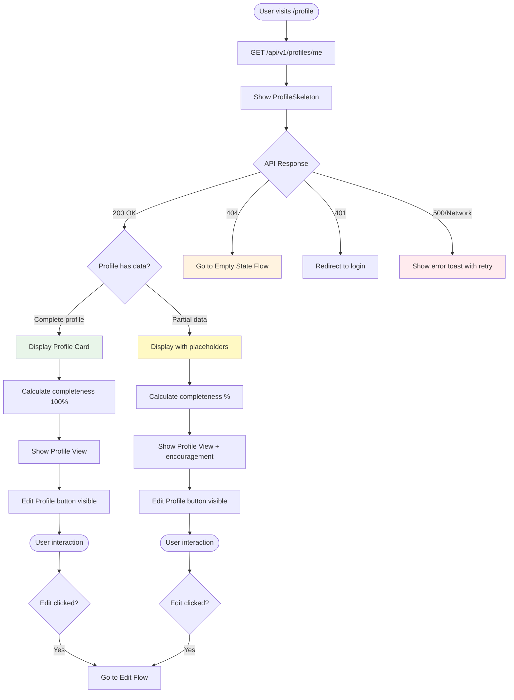
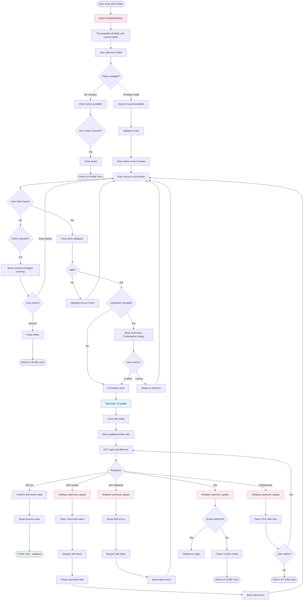
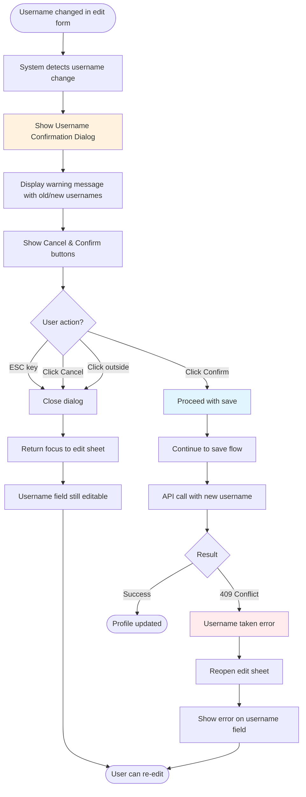

# 3. User Flows

## 3.1 Flow 1: Profile Creation (First-Time User Onboarding)

**User Goal:** Create initial profile to establish identity on Athaar platform

**Entry Points:** 
- User navigates to `/profile` after signup/login
- API returns 404 (no profile exists)
- Empty state "Create Your Profile" CTA clicked

**Success Criteria:** 
- Profile created with valid username and saved to database
- User sees profile view with completeness indicator
- Success toast notification displayed

### Flow Diagram

### Edge Cases & Error Handling:

- **Wizard abandonment:** User navigates away mid-flow → Wizard state resets on return (no persistence across sessions)
- **Session timeout during wizard:** Token expires before completion → Show auth error, redirect to login, lose wizard progress
- **Network interruption:** API call fails → Show retry option, maintain wizard state, don't reset form data
- **Username conflict at final step:** 409 error → Navigate back to Step 1, focus username field, preserve other entered data
- **Validation mismatch:** Backend rejects data that passed client validation → Highlight affected step in wizard, show specific errors
- **Partial form data:** User completes Step 1-2, closes browser → Next visit starts fresh wizard (no localStorage persistence in MVP)

---

## 3.2 Flow 2: Profile Viewing

**User Goal:** View complete profile information and assess completeness

**Entry Points:**
- Profile exists in database
- After successful profile creation
- After successful profile update
- Direct navigation to `/profile`

**Success Criteria:**
- All profile fields displayed correctly
- Completeness percentage calculated and shown
- Social links functional and open in new tabs
- Edit button accessible

### Flow Diagram

### Edge Cases & Error Handling:

- **Empty optional fields:** Display "No bio added" placeholders in muted text (not blank/broken UI)
- **Invalid cached data:** After page load, if profile data seems stale → Provide manual refresh option
- **Broken image URLs:** Profile picture fails to load → Show default avatar placeholder, don't break layout
- **Social link domain validation:** User entered valid URL format but wrong domain → Display as-is (backend doesn't validate domains)
- **Very long bio/username:** Content exceeds typical display area → Truncate with "Read more" or ensure scrollable container
- **Completeness calculation error:** Missing fields in calculation logic → Default to showing raw data without percentage

---

## 3.3 Flow 3: Profile Editing

**User Goal:** Update profile information quickly and confidently

**Entry Points:**
- User clicks "Edit Profile" button from Profile View
- After error in previous edit attempt (sheet reopens)

**Success Criteria:**
- Changes saved successfully to database
- Optimistic UI update provides immediate feedback
- Validation errors shown inline before submission
- Sheet closes after successful save

### Flow Diagram

### Edge Cases & Error Handling:

- **Mid-edit session timeout:** Token expires while form open → On save, show auth error, don't lose form data
- **Concurrent edits:** User has profile open in two tabs, edits in both → Last write wins (no conflict detection in MVP)
- **Invalid URL formats:** User enters URL without https:// → Client validation catches, shows format helper
- **Extremely long inputs:** User pastes 10,000 character bio → Character counter prevents submission
- **Whitespace-only inputs:** User enters spaces in bio → Transform to undefined, treated as empty
- **Sheet close during API call:** User closes sheet while save in progress → Allow close, continue API call, show toast on completion

---

## 3.4 Flow 4: Username Change Confirmation

**User Goal:** Safely change username with full understanding of implications

**Entry Points:**
- User modifies username field in edit form and clicks Save

**Success Criteria:**
- User makes informed decision about username change
- Canceling returns to edit form without data loss
- Confirming proceeds with save and appropriate error handling

### Flow Diagram

### Edge Cases & Error Handling:

- **Username unchanged but whitespace differs:** Normalize before comparison, don't trigger dialog if functionally same
- **Case-only change:** "johndoe" to "JohnDoe" → Still considered a change (database is case-sensitive), show confirmation
- **Rapid dialog dismissal:** User immediately hits ESC → Allow instant dismiss, no confirmation timeout
- **Multiple username changes:** User changes, cancels, changes again → Dialog shows latest old→new comparison each time

---

